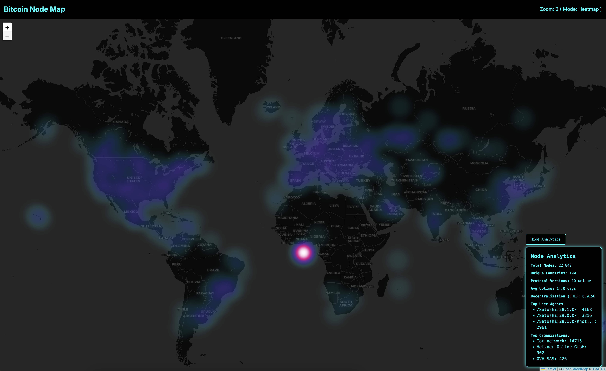
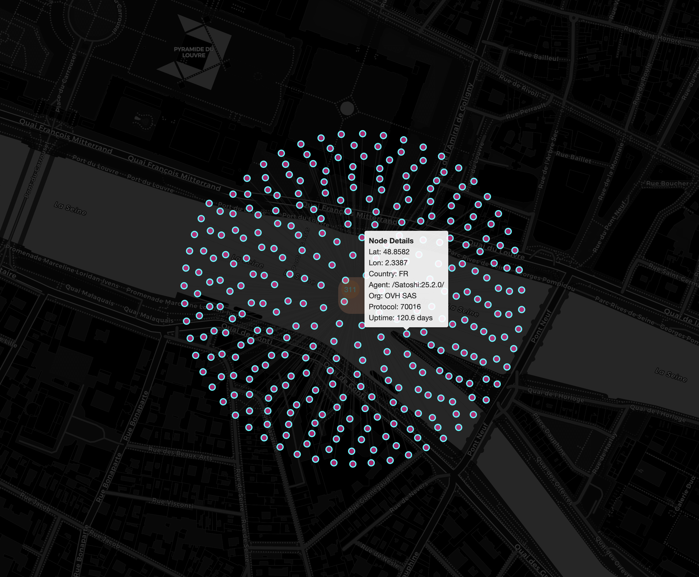
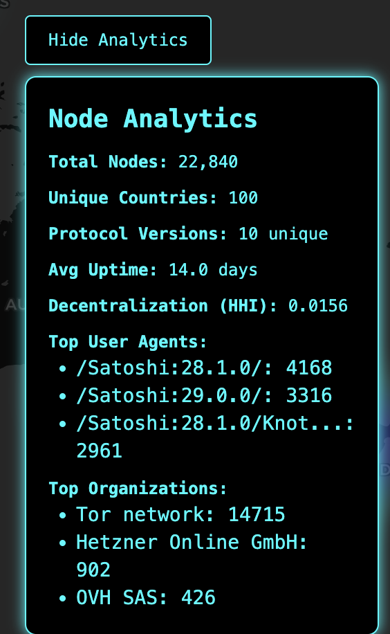

# Bitcoin Node Map 🌍

A real-time interactive map visualizing the global distribution of Bitcoin nodes.

 <!-- Add your screenshot here -->

## Features

- 🌐 **Live Node Data:** Fetches the latest node data from the Bitnodes API.
- 🔥 **Heatmap & Clusters:** See node density as a heatmap (zoomed out) or as interactive clusters (zoomed in).
- 📊 **Analytics Dashboard:** View top countries, organizations, protocol versions, and more.
- 🌓 **Dark Theme:** Modern neon-inspired dark UI.
- 📱 **Mobile Responsive:** Works great on all devices.

## Demo

[Live Demo on GitHub Pages](https://YOUR_USERNAME.github.io/bitcoin-heatmap/)

## Screenshots

| Map View                      | Analytics Panel                           |
| ----------------------------- | ----------------------------------------- |
|  |  |

## Getting Started

1. **Clone the repo:**

   ```sh
   git clone https://github.com/YOUR_USERNAME/bitcoin-heatmap.git
   cd bitcoin-heatmap
   ```

2. **Install dependencies:**

   ```sh
   npm install
   ```

3. **Run locally:**

   ```sh
   npm run dev
   ```

4. **Build for production:**
   ```sh
   npm run build
   ```

## Contributing

Pull requests are welcome! For major changes, please open an issue first.

## License

[MIT](./LICENSE)
